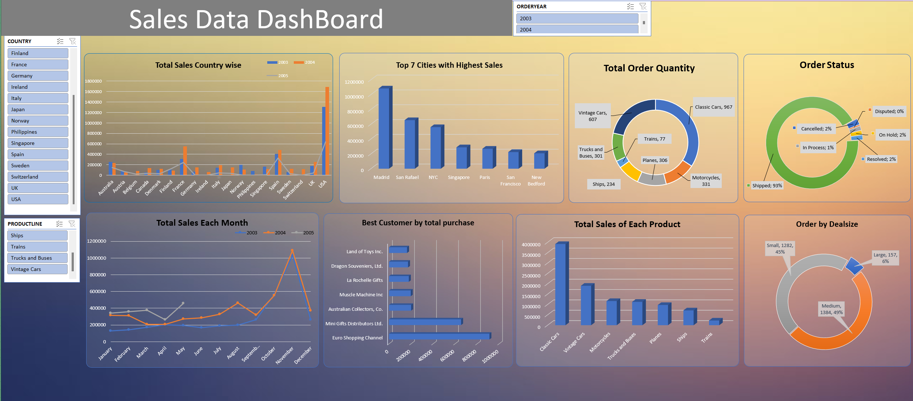

# 📈 Sales Analysis Dashboard Reports

## Link for interactive dashboard
- **If you want to to playy with interactive dashboard click down below on a link**

[Link of the interactive dashboard of sales data](https://onedrive.live.com/personal/0de14f895df64d8e/_layouts/15/Doc.aspx?sourcedoc=%7Ba5728e77-629d-44f8-b1ca-d8f34dee5940%7D&action=default&redeem=aHR0cHM6Ly8xZHJ2Lm1zL3gvYy8wZGUxNGY4OTVkZjY0ZDhlL0VYZU9jcVdkWXZoRXNjclk4MDN1V1VBQkdNY1pBV2ljaDhBQ3MxWE4xUlVkUHc&slrid=5e4a66a1-9047-7000-0302-570025879de7&originalPath=aHR0cHM6Ly8xZHJ2Lm1zL3gvYy8wZGUxNGY4OTVkZjY0ZDhlL0VYZU9jcVdkWXZoRXNjclk4MDN1V1VBQkdNY1pBV2ljaDhBQ3MxWE4xUlVkUHc_cnRpbWU9Y1dwSmtMc0szVWc&CID=2a7c8860-e92d-4e49-8250-f31822dccc82&_SRM=0:G:46)

## 🌍 Country-Level Insights
- **United States** leads as the top-selling country with:
  - 🟢 **500 orders** in the medium category.
  - 🔵 **440 orders** in the small category.
- **Spain** and **France** follow closely, ranking second and third, even with the **highest number of large deals**.

---

## 🏙️ City-Level Insights
- **Top-performing Cities**:
  1. 🥇 **Madrid**: Total sales exceeding **$100k**.
  2. 🥈 **San Rafael**: The second-highest total sales.
  3. 🥉 **NYC**: Ranking third in total sales.

---

## 📅 Monthly Sales Trends
- **November** stands out as the best month, with sales surpassing **1 million units**.  
  - 📦 Driven by **holiday gift purchases**, particularly toys for children.  
- **October** also shows a significant spike in sales for 2003 and 2004.  
- 📈 The first four months of **2005** indicate a **positive trajectory**, suggesting promising future performance.

---

## 🏆 Top Customers
- **Euro Shopping Channel**: The top customer with the **highest total purchases** over three years.  
- **Mini Gifts Distributors**: A close second, showcasing strong client engagement.

---

## ✅ Order Status
- **93% of orders** have been successfully processed and shipped. 🚚  
- **2%** are **canceled**, **2%** are **on hold**, and the remaining **3%** fall under other categories.

---

## 🚗 Product Insights
- **Classic Cars**: Best-selling product with:
  - 💰 Total sales exceeding **$3.9 million**.
  - 📦 **967 orders**, mostly in the **medium size category**.
- **Vintage Cars**: Second-best with:
  - 💰 **$1.9 million** in sales from **607 orders**.
  - ℹ️ Average deal size is **three times smaller** than classic cars.
- **Trains**: The lowest-performing product with:
  - 📦 Only **77 orders** resulting in **$220k in sales**.

---

## 🎉 Seasonal Sales Spike
- **November**'s surge aligns with holiday gift-giving trends, especially for children.  
- Typical **delivery time of one month** explains the high order volume during this period.

---

## 🇺🇸 US Sales Insights
- **San Rafael** and **NYC** lead as the top cities in the USA.  
- 🗓️ Significant order volumes in **November** and **August** contribute to their sales success.
