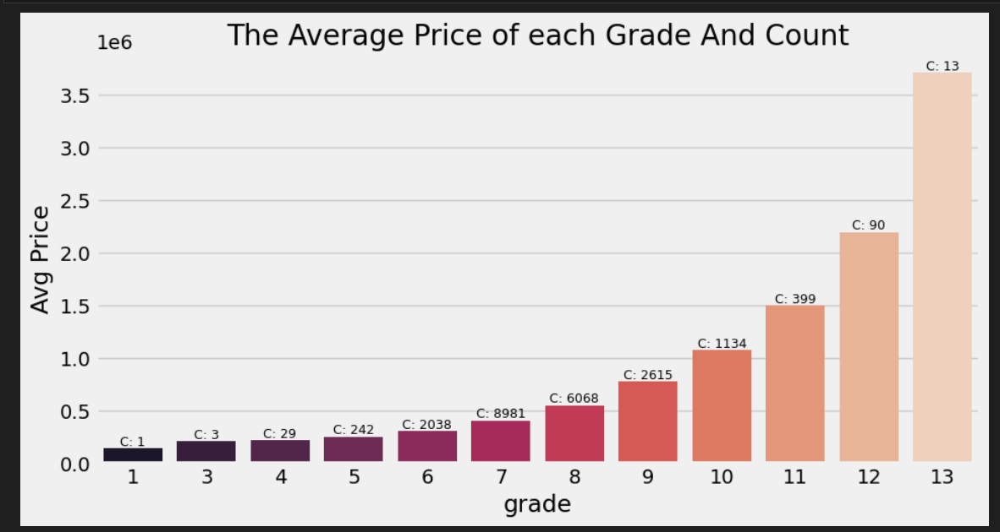
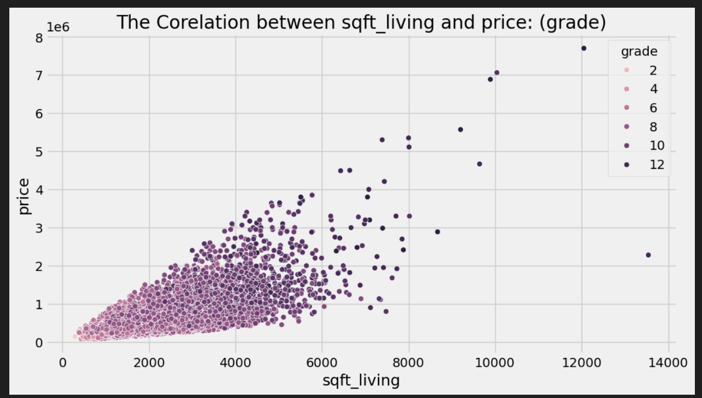
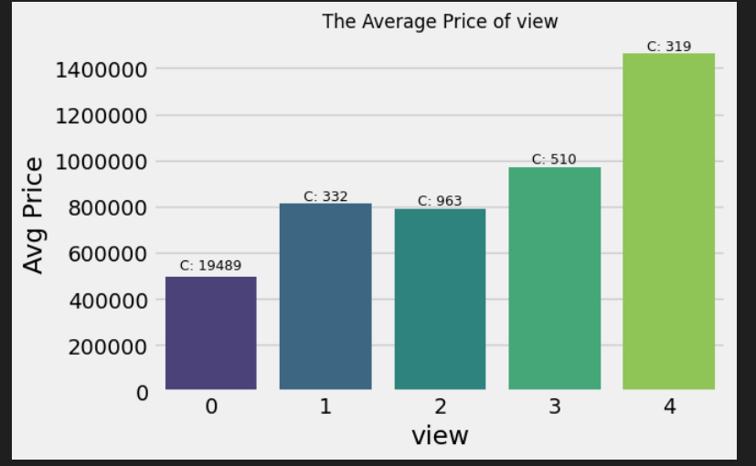
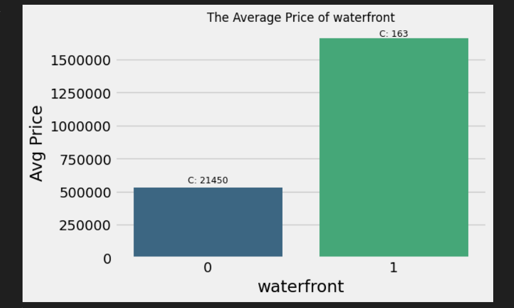

# Housing Data Analysis & Price Prediction

### 📊 Overview

This project involves analyzing a housing dataset to uncover valuable insights about house prices based on various features like the number of bedrooms, bathrooms, floor area, and more. The data has been pre-processed and analyzed through Exploratory Data Analysis (EDA), and the results have been used to identify patterns and trends in the housing market.

### 🔧 Data Cleaning & Transformation

To prepare the dataset for analysis, I made several key changes:
- **Waterfront column**: Transformed from 0/1 to `Yes`/`No` for better readability.
- **Floor column**: Changed from a boolean to a whole number, as it didn’t make sense to represent floors in a binary format.
- **Condition column**: Changed from a numeric to a text field for clarity (e.g., "Excellent", "Good").
- **View column**: Transformed to text based on its numeric representation for better understanding.
- **Date column**: Converted from text to `datetime` format for easier analysis.
- **Bedroom column**: Corrected a value of 33 to 3, as it was clearly an outlier.
- **Floor column**: Changed the type to a whole number, with corrections made for entries that seemed inconsistent (e.g., a building with only 3 or 4 rooms and multiple floors).
- **Price Range**: Added a new column to categorize house prices into 4 categories: "Cheap", "Average", "Expensive", "Most Expensive".

### 🏡 Key Insights & Analysis 

- **Average House Characteristics**:
  - **Average Bedrooms**: 3
  - **Average Bathrooms**: 2
  - **Average Price**: $500,000
  - **Average Sqft Living Area**: 2,000 sqft

- **Distribution of Floors**:
  - 50% of houses have 1 floor.
  - 47% have 2 floors.
  - Only 3% have 3 or more floors.

- **Waterfront Presence**:
  - 99.2% of houses have no waterfront.
  - Only 0.8% have a waterfront view.

- **Quarterly Sales Trends**:
  - The second quarter saw the highest number of sales, contributing to an increase in average prices.

Click to expand for EDA insights

    
    

    
    

#### Price Range Breakdown:

- **Most Expensive Houses**:   
  - **Average Price**: $3.2 million
  - **Waterfront**: 32 houses with an average price of $3.4 million
  - **Average Sqft Living**: 5,520 sqft
  - **Floor Distribution**: 80% with 2 floors, 18% with 1 floor, 2% with 3 floors

- **Expensive Houses**:
  - **Average Price**: $1.4 million
  - **Waterfront**: 72 houses with an average price of $1.67 million
  - **Average Sqft Living**: 3,500 sqft
  - **Floor Distribution**: 62% with 2 floors, 27% with 1 floor, 9% with 3 floors

- **Average Houses**:
  - **Average Price**: $553k
  - **Waterfront**: 56 houses with an average price of $667k
  - **Average Sqft Living**: 2,100 sqft
  - **Floor Distribution**: 46% with 2 floors, 51% with 1 floor, 2% with 3 floors

- **Cheap Houses**:
  - **Average Price**: $240k
  - **Waterfront**: 2 houses with an average price of $670k
  - **Average Sqft Living**: 1,400 sqft
  - **Floor Distribution**: 26% with 2 floors, 72% with 1 floor, 0.6% with 3 floors

### 🏠 More In-Depth Observations

- **Impact of Condition & Square Footage**:
  - Houses with higher grades and larger square footage tend to be more expensive. Larger homes, especially those over 7,000 sqft, can exceed $3 million in price.
  - The cheapest houses tend to have lower square footage and no views, with 97% having no view.

- **Effect of Views on Price**:
  - Houses with **excellent views** command significantly higher prices (around $1.5 million), while those with no view are much cheaper (around $500k).

- **Waterfront Homes**:
  - Homes with waterfront views have a higher average price. A 2-floor waterfront home averages around $1.9 million with 3,500 sqft of living space.

- **Correlation Between Grade and Price**:
  - Homes with a **high grade** (10+) and **good condition** (excellent view) have the highest average prices, particularly when combined with a larger square footage.

### 💡 Key Takeaways

1. **Living Area Matters**: The larger the living area, the higher the price, especially for homes with more than 7,000 sqft of space.
2. **Waterfront and Views**: Waterfront properties, along with excellent views, significantly increase the price.
3. **Condition & Grade**: Homes in excellent condition with high grades command a premium price, even without views or waterfront.
4. **Cheap Houses**: The majority of cheaper houses have no view, small living areas, and lower grades.

---

### 🔧 Tools & Libraries Used

- **Python**: Pandas, Matplotlib, Seaborn for data analysis and visualization
- **SQL**: For querying and working with the data
- **Power BI**: For interactive visualizations (if applicable)
- **Jupyter Notebooks**: For presenting the analysis in an organized format

---

### 📊 Conclusion

This analysis sheds light on the key factors that affect house prices, including size, condition, view, and whether the house has a waterfront. It highlights that while square footage and condition are crucial, a house with a good view or waterfront is likely to command a much higher price, regardless of its size.
